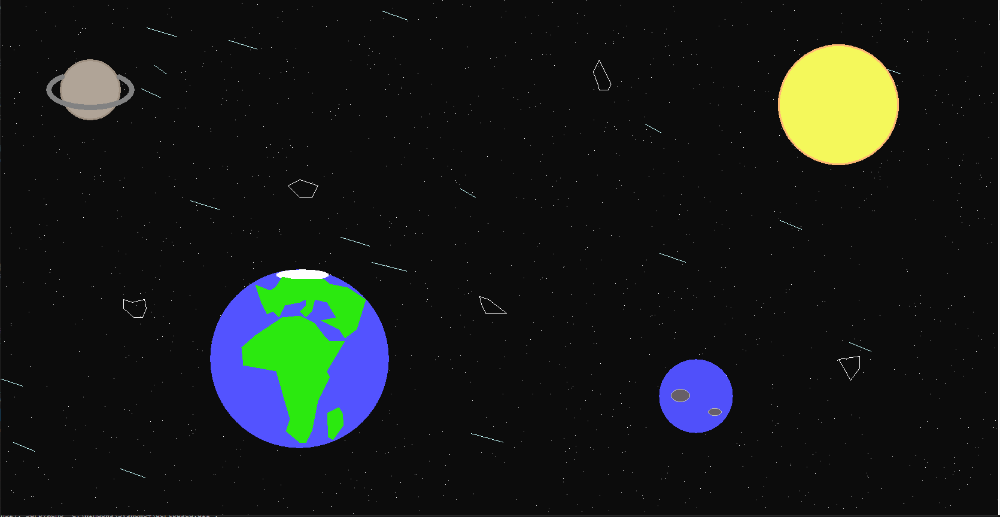

Все графические функции использовали специальную структуру, контекст окна. Она хранит текущие параметры области, в которой мы рисуем.
Контекст храниться в переменной типа HDC(Handle to Device Context)

Графика в консоли видна тогда, когда рисование выпоняется в видимое окно. 
После сворачивания или перекрытия окна консоли графика исчезает. 
На самом деле приложения Windows получают сообщение от ОС о том, что они должны перерисовать свое окно (или его часть) и 
программисты помещают вызов графических функций в обработчик этого сообщения (специальную функцию). 

В программе, написанной для консоли, мы не можем перехватить и обработать такое сообщение. Но перерисовка консоли 
после восстановления видимости ее окна все равно происходит. Это приводит к 
рисованию «пустоты», т.е. к очистке окна. Поэтому приходится «выкручиваться». 

После сворачивания или перекрытия окна консоли рисование 
нужно повторить. Для этого программе создали функцию draw(.), которую могли вызвать клавишей „p‟

​

